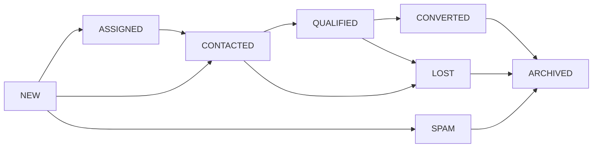

# Hauslet Leads System - Complete Guide

## Table of Contents
1. [Overview](#overview)
2. [Core Concepts](#core-concepts)
3. [Lead Lifecycle](#lead-lifecycle)
4. [Hybrid Authentication](#hybrid-authentication)
5. [Spam Protection](#spam-protection)
6. [Rate Limiting](#rate-limiting)
7. [GraphQL API Reference](#graphql-api-reference)
8. [Usage Examples](#usage-examples)
9. [Marketing Campaign Tracking](#marketing-campaign-tracking)
10. [Lead Management](#lead-management)
11. [Best Practices](#best-practices)

---

## Overview

The **Hauslet Leads System** is a sophisticated lead capture and management platform designed for Nigerian real estate. It bridges potential customers (tenants/buyers) with property owners (landlords/agents) while providing robust spam protection, marketing attribution, and lead nurturing tools.

### Key Features

- **Hybrid Authentication**: Works seamlessly with both logged-in users and anonymous visitors
- **Intelligent Spam Detection**: Pattern-based spam scoring to filter out fraudulent inquiries
- **Rate Limiting**: Database-backed rate limits to prevent abuse (3 leads/email/day, 10 leads/IP/day)
- **Marketing Attribution**: Automatic UTM parameter capture for campaign tracking
- **Lead Routing**: Automatic assignment to property owners or business team members
- **Audit Trail**: Complete event history for every lead action
- **Response Time Tracking**: Measure how quickly teams respond to inquiries
- **Lead Qualification Pipeline**: Track leads from "NEW" → "CONTACTED" → "QUALIFIED" → "CONVERTED"

---

## Core Concepts

### What is a Lead?

A **Lead** represents a potential customer inquiry about a property listing. Each lead contains:

- **Contact Information**: Name, email, phone number
- **Inquiry Details**: Message expressing interest, questions, or booking intent
- **Source Attribution**: Where the lead came from (website, mobile app, WhatsApp, etc.)
- **Marketing Context**: UTM parameters, referrer URL, user agent
- **Spam Signals**: Automated spam score (0.0 = clean, 1.0 = spam)
- **Status**: Current lifecycle stage (NEW, CONTACTED, QUALIFIED, etc.)
- **Assignment**: Which agent/team member is handling the lead
- **Response Metrics**: Time to first response, total response count

### Lead vs. Authenticated User

| Aspect | Anonymous Lead | Authenticated Lead |
|--------|----------------|-------------------|
| **User ID** | NULL | UUID reference to users table |
| **Verification** | Not verified | Profile verified |
| **Spam Score** | Full calculation (0.0-1.0) | Reduced by 50% (trusted user) |
| **Form Filling** | Manual entry required | Auto-filled from profile |
| **Rate Limiting** | Standard (3/day) | Standard (3/day) |
| **Trust Level** | Low (first contact) | High (existing customer) |

---

## Lead Lifecycle

### Status States

Leads progress through an 8-stage lifecycle:

```
1. NEW         → Just created, awaiting first contact
2. ASSIGNED    → Assigned to agent/team member
3. CONTACTED   → Agent has reached out (call/email/WhatsApp)
4. QUALIFIED   → Lead is serious and interested
5. CONVERTED   → Deal closed (sale/rental completed)
6. LOST        → Lead did not convert
7. SPAM        → Marked as spam/fraudulent
8. ARCHIVED    → Closed and archived
```

### State Transition Flow



### Automatic Transitions

The system automatically handles some transitions:

- **NEW → ASSIGNED**: When `AssignLead()` is called
- **ASSIGNED → NEW**: When `Unassign()` is called (if still in ASSIGNED status)
- **ANY → SPAM**: When spam score > 0.8 or manually flagged

---

## Hybrid Authentication

The Leads system supports both anonymous and authenticated users, providing a seamless experience regardless of login status.

### Flow 1: Anonymous User (No Account)

**Scenario**: Visitor from Google Ad clicks listing, wants to inquire

```
1. User lands on listing page (no login)
2. Clicks "Contact Owner" button
3. Form displays with empty fields:
   - Name: [empty]
   - Email: [empty]
   - Phone: [empty]
   - Message: [empty]
4. User manually fills all fields
5. Submits form
6. System validates and creates lead with:
   - user_id: NULL
   - is_verified: FALSE
   - spam_score: calculated (0.0-1.0)
   - source: WEBSITE
   - status: NEW
```

**Benefits for User**:
- No registration required
- Immediate contact with owner
- Privacy preserved (optional phone)

**Benefits for Owner**:
- Capture all inquiries, even from unregistered users
- Marketing attribution via UTM tracking
- Spam filtering protects from bots

### Flow 2: Authenticated User (Logged In)

**Scenario**: Registered user browsing listings

```
1. User logs in to Hauslet account
2. Browses listings and clicks "Contact Owner"
3. Form displays with AUTO-FILLED fields:
   - Name: [John Doe] ✅
   - Email: [john@example.com] ✅
   - Phone: [+234 803 123 4567] ✅
   - Message: [empty - user types]
4. User only needs to write message
5. Submits form
6. System creates lead with:
   - user_id: abc-123-def
   - is_verified: TRUE
   - spam_score: reduced by 50%
   - source: WEBSITE
   - status: NEW
```

**Benefits for User**:
- Faster inquiry (no re-typing contact info)
- Lead history tracked across listings
- Response history visible in dashboard

**Benefits for Owner**:
- Higher quality leads (verified profiles)
- Lower spam probability
- Ability to view user's inquiry history

### Implementation in GraphQL

```graphql
mutation CreateLeadAnonymous {
  createLead(input: {
    listingId: "listing-uuid"
    name: "Jane Smith"
    email: "jane@example.com"
    phoneNumber: "+234 805 555 1234"
    message: "I'm interested in viewing this property. When is a good time?"
    source: WEBSITE
  }) {
    id
    status
    spamScore
    isSpam
  }
}
```

**Authenticated user** (system auto-detects from JWT in Authorization header):
```graphql
mutation CreateLeadAuthenticated {
  createLead(input: {
    listingId: "listing-uuid"
    # name, email, phone auto-filled from user profile
    message: "I'm interested in viewing this property."
    source: MOBILE_APP
    utmParams: {
      utm_source: "facebook"
      utm_campaign: "jan_2026_lekki"
    }
  }) {
    id
    status
    spamScore  # Automatically reduced by 50%
    isVerified # TRUE
  }
}
```

---

## Spam Protection

The Leads system implements multi-layered spam protection to ensure property owners receive only legitimate inquiries.

### Spam Detection Layers

#### 1. **Pattern-Based Scoring**

The system checks messages against known spam patterns:

| Pattern | Score Added | Example |
|---------|-------------|---------|
| Viagra/casino keywords | +0.3 | "Buy viagra online cheap!" |
| Marketing spam phrases | +0.3 | "CLICK HERE NOW! Limited offer!" |
| Long suspicious URLs | +0.3 | "http://malicious-site.com/very/long/path/..." |
| Multiple consecutive URLs | +0.3 | "http://site1.com http://site2.com http://site3.com" |
| Excessive repeated chars | +0.3 | "Hellooooooooooo" (10+ same character) |
| Spam keywords | +0.2 each | "bitcoin investment", "guaranteed profit", "make money fast" |
| Suspicious email domain | +0.3 | "user@tempmail.com", "user@throwaway.com" |
| Too many dots/plus signs | +0.1 | "user...name+test+test@gmail.com" |

#### 2. **Email Validation**

- Standard RFC 5322 email format validation
- MX record lookup (optional, configurable)
- Disposable email domain blocking (10minutemail, guerrillamail, etc.)

#### 3. **Content Length Checks**

```go
// Validation rules
Name:    1-255 characters
Email:   Must be valid format
Phone:   Optional, E.164 format (+234...)
Message: 10-2000 characters (enforced minimum prevents lazy spam)
```

#### 4. **Authenticated User Bonus**

Logged-in users receive a **50% spam score reduction**:

```
Anonymous user with pattern match: spam_score = 0.6
Authenticated user with same pattern: spam_score = 0.3 (60% reduction applied)
```

### Spam Score Interpretation

| Score Range | Classification | Action |
|-------------|---------------|--------|
| 0.0 - 0.3 | Clean | Lead created and routed normally |
| 0.4 - 0.6 | Suspicious | Lead created but flagged for review |
| 0.7 - 0.8 | Likely Spam | Lead created with is_spam=true (hidden from default views) |
| 0.9 - 1.0 | Definite Spam | Lead rejected or auto-archived |

### Manual Spam Marking

Property owners can manually mark leads as spam:

```graphql
mutation {
  markLeadAsSpam(leadId: "lead-uuid")
}
```

**Effect**:
- Lead status changed to SPAM
- Lead hidden from default queries
- LeadEvent created with type=MARKED_SPAM
- Email address added to spam watch list (future leads auto-flagged)

---

## Rate Limiting

Database-backed rate limiting prevents abuse while allowing legitimate inquiries.

### Rate Limit Rules

| Limit Type | Threshold | Window | Purpose |
|------------|-----------|--------|---------|
| **Per Email** | 3 leads | 24 hours | Prevent single user from spamming multiple listings |
| **Per IP Address** | 10 leads | 24 hours | Prevent bot attacks from single source |
| **Per Listing + Email** | 5 leads | 24 hours | Prevent harassment of specific listing owner |

### Rate Limit Errors

When a limit is exceeded, the API returns:

```json
{
  "errors": [
    {
      "message": "Rate limit exceeded: Maximum 3 leads per email per 24 hours",
      "extensions": {
        "code": "EMAIL_RATE_LIMIT_REACHED",
        "limit": 3,
        "windowHours": 24,
        "retryAfter": "2026-01-04T10:30:00Z"
      }
    }
  ]
}
```

### Database Optimization

Rate limit checks use optimized composite indexes:

```sql
-- Indexes for fast rate limit queries
CREATE INDEX idx_leads_email_created ON leads(email, created_at);
CREATE INDEX idx_leads_ip_created ON leads(ip_address, created_at);
CREATE INDEX idx_leads_listing_email_created ON leads(listing_id, email, created_at);
```

### Rate Limit Status API

Check current status before submitting (optional):

```graphql
query {
  rateLimitStatus(
    email: "user@example.com"
    ipAddress: "197.210.10.50"
    listingId: "listing-uuid"
  ) {
    emailCount
    emailLimit
    emailRemaining
    ipCount
    ipLimit
    ipRemaining
    listingCount
    listingLimit
    listingRemaining
  }
}
```

---

## GraphQL API Reference

### Mutations

#### 1. Create Lead (Public - No Auth Required)

```graphql
mutation CreateLead($input: CreateLeadInput!) {
  createLead(input: $input) {
    id
    listingId
    businessId
    name
    email
    phoneNumber
    message
    source
    status
    spamScore
    isSpam
    createdAt
  }
}
```

**Input Variables**:
```json
{
  "input": {
    "listingId": "550e8400-e29b-41d4-a716-446655440000",
    "name": "Chidi Okafor",
    "email": "chidi.okafor@gmail.com",
    "phoneNumber": "+234 803 555 1234",
    "message": "Hello, I'm interested in this 3-bedroom apartment. Is it still available? I'd like to schedule a viewing this weekend if possible.",
    "source": "WEBSITE",
    "utmParams": {
      "utm_source": "facebook",
      "utm_medium": "cpc",
      "utm_campaign": "lekki_apartments_jan2026",
      "utm_content": "ad_variant_b"
    }
  }
}
```

**Response**:
```json
{
  "data": {
    "createLead": {
      "id": "lead-uuid-here",
      "listingId": "550e8400-e29b-41d4-a716-446655440000",
      "businessId": "business-uuid-here",
      "name": "Chidi Okafor",
      "email": "chidi.okafor@gmail.com",
      "phoneNumber": "+234 803 555 1234",
      "message": "Hello, I'm interested in this 3-bedroom apartment...",
      "source": "WEBSITE",
      "status": "NEW",
      "spamScore": 0.0,
      "isSpam": false,
      "createdAt": "2026-01-03T10:30:00Z"
    }
  }
}
```

#### 2. Update Lead Status (Requires Auth)

```graphql
mutation UpdateLeadStatus($leadId: ID!, $status: LeadStatus!, $notes: String) {
  updateLeadStatus(leadId: $leadId, status: $status, notes: $notes) {
    id
    status
    updatedAt
  }
}
```

**Input Variables**:
```json
{
  "leadId": "lead-uuid",
  "status": "CONTACTED",
  "notes": "Called lead, scheduled viewing for Saturday 10am"
}
```

#### 3. Assign Lead (Requires Auth)

```graphql
mutation AssignLead($leadId: ID!, $assigneeId: ID!, $reason: AssignmentReason!) {
  assignLead(leadId: $leadId, assigneeId: $assigneeId, reason: $reason) {
    id
    assignedTo
    assignedAt
    autoAssigned
    status
  }
}
```

**Input Variables**:
```json
{
  "leadId": "lead-uuid",
  "assigneeId": "agent-user-uuid",
  "reason": "MANUAL"
}
```

**Assignment Reasons**:
- `AUTO`: System automatically assigned based on rules
- `MANUAL`: Manager/admin manually assigned
- `REASSIGN`: Transferred from another agent
- `ESCALATE`: Escalated to senior agent/manager

#### 4. Mark as Spam (Requires Auth)

```graphql
mutation MarkAsSpam($leadId: ID!) {
  markLeadAsSpam(leadId: $leadId)
}
```

#### 5. Delete Lead (Requires Auth)

```graphql
mutation DeleteLead($leadId: ID!) {
  deleteLead(leadId: $leadId)
}
```

**Note**: This is a soft delete (sets `deleted_at` timestamp).

### Queries

#### 1. Get Single Lead (Requires Auth)

```graphql
query GetLead($id: ID!) {
  lead(id: $id) {
    id
    listingId
    businessId
    name
    email
    phoneNumber
    message
    source
    status
    spamScore
    isSpam
    assignedTo
    assignedAt
    autoAssigned
    firstResponseAt
    responseTime
    responseCount
    createdAt
    updatedAt
  }
}
```

#### 2. Get Leads by Listing (Requires Auth)

```graphql
query LeadsByListing(
  $listingId: ID!
  $filter: LeadFilterInput
  $page: PageInput
) {
  leadsByListing(listingId: $listingId, filter: $filter, page: $page) {
    items {
      id
      name
      email
      phoneNumber
      message
      source
      status
      spamScore
      createdAt
    }
    totalCount
    hasNextPage
  }
}
```

**Input Variables**:
```json
{
  "listingId": "listing-uuid",
  "filter": {
    "status": ["NEW", "ASSIGNED"],
    "isSpam": false,
    "dateFrom": "2026-01-01T00:00:00Z",
    "dateTo": "2026-01-31T23:59:59Z"
  },
  "page": {
    "limit": 20,
    "offset": 0
  }
}
```

#### 3. Get Leads by Business (Requires Auth)

```graphql
query LeadsByBusiness(
  $businessId: ID!
  $filter: LeadFilterInput
  $page: PageInput
) {
  leadsByBusiness(businessId: $businessId, filter: $filter, page: $page) {
    items {
      id
      listingId
      name
      email
      message
      status
      assignedTo
      createdAt
    }
    totalCount
    hasNextPage
  }
}
```

#### 4. Get My Assigned Leads (Requires Auth)

```graphql
query MyLeads($filter: LeadFilterInput, $page: PageInput) {
  myLeads(filter: $filter, page: $page) {
    items {
      id
      listingId
      name
      email
      phoneNumber
      message
      status
      firstResponseAt
      responseTime
      createdAt
    }
    totalCount
    hasNextPage
  }
}
```

#### 5. Get Lead History (Requires Auth)

```graphql
query LeadHistory($leadId: ID!) {
  leadHistory(leadId: $leadId) {
    id
    leadId
    eventType
    actorId
    actorType
    oldStatus
    newStatus
    notes
    createdAt
  }
}
```

**Response Example**:
```json
{
  "data": {
    "leadHistory": [
      {
        "id": "event-1",
        "leadId": "lead-uuid",
        "eventType": "CREATED",
        "actorId": null,
        "actorType": "SYSTEM",
        "oldStatus": null,
        "newStatus": "NEW",
        "notes": null,
        "createdAt": "2026-01-03T10:30:00Z"
      },
      {
        "id": "event-2",
        "leadId": "lead-uuid",
        "eventType": "ASSIGNED",
        "actorId": "manager-uuid",
        "actorType": "USER",
        "oldStatus": "NEW",
        "newStatus": "ASSIGNED",
        "notes": "Assigned to John - he handles Lekki properties",
        "createdAt": "2026-01-03T10:45:00Z"
      },
      {
        "id": "event-3",
        "leadId": "lead-uuid",
        "eventType": "CONTACTED",
        "actorId": "agent-uuid",
        "actorType": "USER",
        "oldStatus": "ASSIGNED",
        "newStatus": "CONTACTED",
        "notes": "Called lead, scheduled viewing for Saturday",
        "createdAt": "2026-01-03T11:15:00Z"
      }
    ]
  }
}
```

---

## Usage Examples

### Scenario 1: Property Owner Receives Lead

**Context**: Independent landlord with 1 listing receives inquiry from Facebook ad

```graphql
# 1. User submits lead (public mutation)
mutation {
  createLead(input: {
    listingId: "listing-123"
    name: "Funke Adeyemi"
    email: "funke@yahoo.com"
    phoneNumber: "+234 802 345 6789"
    message: "I saw your ad on Facebook. I'm looking for a 2-bedroom in Ikeja. Is this still available?"
    source: WEBSITE
    utmParams: {
      utm_source: "facebook"
      utm_campaign: "ikeja_2bed"
    }
  }) {
    id
    status
    spamScore
  }
}

# 2. Owner receives email notification
# 3. Owner logs in and views lead
query {
  leadsByListing(listingId: "listing-123", filter: {status: [NEW]}) {
    items {
      id
      name
      email
      phoneNumber
      message
      source
      createdAt
    }
  }
}

# 4. Owner calls lead and updates status
mutation {
  updateLeadStatus(
    leadId: "lead-456"
    status: CONTACTED
    notes: "Spoke with Funke, she's coming for viewing tomorrow 2pm"
  ) {
    id
    status
    responseTime  # Automatically calculated
  }
}

# 5. After viewing, owner qualifies lead
mutation {
  updateLeadStatus(
    leadId: "lead-456"
    status: QUALIFIED
    notes: "Very interested, ready to pay rent + agency fee"
  ) {
    status
  }
}

# 6. Deal closes
mutation {
  updateLeadStatus(
    leadId: "lead-456"
    status: CONVERTED
    notes: "Rent paid, tenant moves in next Monday"
  ) {
    status
  }
}
```

### Scenario 2: Real Estate Agency with Team

**Context**: Agency with 5 agents managing 30 listings

```graphql
# 1. Lead comes in for luxury property
mutation {
  createLead(input: {
    listingId: "luxury-villa-001"
    name: "Ibrahim Musa"
    email: "ibrahim.musa@company.com"
    phoneNumber: "+234 803 111 2222"
    message: "Interested in the 5-bedroom villa in Banana Island. I'm relocating from Abuja and need to move in by end of month."
    source: WEBSITE
  }) {
    id
    businessId  # Automatically linked to agency
  }
}

# 2. Manager assigns to senior agent (manual)
mutation {
  assignLead(
    leadId: "lead-789"
    assigneeId: "senior-agent-uuid"
    reason: MANUAL
  ) {
    id
    assignedTo
    status  # Changed to ASSIGNED
  }
}

# 3. Agent views their assigned leads
query {
  myLeads(filter: {status: [ASSIGNED, CONTACTED]}) {
    items {
      id
      listingId
      name
      phoneNumber
      message
      assignedAt
      createdAt
    }
  }
}

# 4. Agent contacts and updates
mutation {
  updateLeadStatus(
    leadId: "lead-789"
    status: CONTACTED
    notes: "Called Ibrahim, scheduled property tour for Thursday 3pm. He's also interested in seeing 2 other villas."
  ) {
    id
    status
    firstResponseAt
    responseTime  # e.g., 1800 seconds (30 minutes)
  }
}

# 5. After tour, agent qualifies
mutation {
  updateLeadStatus(
    leadId: "lead-789"
    status: QUALIFIED
    notes: "Ibrahim loved the property. Negotiating price - offered ₦18M annual rent vs. listed ₦20M."
  ) {
    status
  }
}

# 6. Manager escalates negotiation
mutation {
  assignLead(
    leadId: "lead-789"
    assigneeId: "manager-uuid"
    reason: ESCALATE
  ) {
    assignedTo
  }
}

# 7. Manager closes deal
mutation {
  updateLeadStatus(
    leadId: "lead-789"
    status: CONVERTED
    notes: "Agreement reached at ₦19M annual. Contracts signed."
  ) {
    status
  }
}

# 8. View complete history
query {
  leadHistory(leadId: "lead-789") {
    eventType
    actorType
    oldStatus
    newStatus
    notes
    createdAt
  }
}
```

### Scenario 3: Filtering Out Spam

**Context**: Property owner dealing with spam inquiries

```graphql
# 1. Spam lead submitted (high spam score)
mutation {
  createLead(input: {
    listingId: "listing-999"
    name: "James Bond"
    email: "winner@tempmail.com"
    message: "CONGRATULATIONS! You've won a FREE Bitcoin investment opportunity! Click here now: http://scam-site.com/get-rich-quick-scheme"
    source: WEBSITE
  }) {
    id
    spamScore  # Returns 0.9 (very high)
    isSpam     # Returns true
    status     # Returns SPAM (auto-marked)
  }
}

# 2. Owner views only clean leads (default)
query {
  leadsByListing(
    listingId: "listing-999"
    filter: {isSpam: false}  # Filter out spam
  ) {
    items {
      name
      email
      message
      spamScore
    }
  }
}

# 3. Owner reviews flagged leads (optional)
query {
  leadsByListing(
    listingId: "listing-999"
    filter: {
      isSpam: true
      status: [SPAM]
    }
  ) {
    items {
      name
      email
      message
      spamScore
      createdAt
    }
  }
}

# 4. Owner manually marks legitimate lead that was mis-classified
mutation {
  updateLeadStatus(
    leadId: "lead-falseflag"
    status: NEW
    notes: "This was actually legitimate - moving to NEW"
  ) {
    id
    status
  }
}
```

---

## Marketing Campaign Tracking

The Leads system automatically captures marketing attribution data to help you understand which campaigns drive the best results.

### UTM Parameter Capture

UTM parameters are automatically extracted from URLs and stored with each lead:

```
Landing Page URL:
https://hauslet.com/listings/xyz-789?
  utm_source=facebook
  &utm_medium=cpc
  &utm_campaign=lekki_apartments_jan2026
  &utm_content=carousel_ad_v2
  &utm_term=2bedroom+lekki

Stored in database as JSONB:
{
  "utm_source": "facebook",
  "utm_medium": "cpc",
  "utm_campaign": "lekki_apartments_jan2026",
  "utm_content": "carousel_ad_v2",
  "utm_term": "2bedroom+lekki"
}
```

### Supported UTM Parameters

| Parameter | Purpose | Example |
|-----------|---------|---------|
| `utm_source` | Campaign source | facebook, google, instagram, email |
| `utm_medium` | Marketing medium | cpc, social, email, referral |
| `utm_campaign` | Campaign name | lekki_apartments_jan2026 |
| `utm_content` | Ad variation | carousel_ad_v2, video_ad_v1 |
| `utm_term` | Keywords (PPC) | 2bedroom+lekki, luxury+apartments |

### Campaign Analytics Queries

```graphql
# Get all leads from a specific campaign
query {
  leadsByBusiness(
    businessId: "business-uuid"
    filter: {
      dateFrom: "2026-01-01T00:00:00Z"
      dateTo: "2026-01-31T23:59:59Z"
    }
  ) {
    items {
      id
      name
      email
      status
      utmParams  # Filter this client-side by utm_campaign
      createdAt
    }
  }
}
```

**Client-side filtering** (TypeScript example):
```typescript
const facebookLeads = allLeads.filter(lead => 
  lead.utmParams?.utm_source === 'facebook'
);

const conversionRate = facebookLeads.filter(lead => 
  lead.status === 'CONVERTED'
).length / facebookLeads.length;

console.log(`Facebook campaign conversion rate: ${conversionRate * 100}%`);
```

### Referrer Tracking

The system automatically captures:

- **Referrer URL**: Which page sent the visitor
- **User Agent**: Browser/device information
- **IP Address**: Geolocation potential (rate limiting)

```json
{
  "referrerUrl": "https://www.facebook.com/hauslet",
  "userAgent": "Mozilla/5.0 (iPhone; CPU iPhone OS 15_0 like Mac OS X)...",
  "ipAddress": "197.210.85.43"
}
```

### Campaign Performance Metrics

Track these key metrics per campaign:

1. **Lead Volume**: Total leads generated
2. **Lead Quality**: Average spam score (lower = better)
3. **Conversion Rate**: % of leads that converted
4. **Response Time**: Average time to first contact
5. **Cost Per Lead**: Ad spend ÷ lead volume
6. **Cost Per Conversion**: Ad spend ÷ conversions

---

## Lead Management

### Response Time Tracking

The system automatically tracks response times to help measure agent performance:

```go
// Automatically calculated when first response recorded
firstResponseAt = 2026-01-03T11:15:00Z
leadCreatedAt   = 2026-01-03T10:30:00Z
responseTime    = 2700 seconds (45 minutes)
```

**Best Practices**:
- **< 30 minutes**: Excellent (hot leads, high conversion)
- **30-60 minutes**: Good (standard response time)
- **1-2 hours**: Acceptable (business hours)
- **> 2 hours**: Poor (lead may go cold)

### Lead Assignment Strategies

#### 1. **Manual Assignment** (Small Teams)

Manager manually assigns leads based on:
- Agent expertise (luxury vs. budget properties)
- Geographic specialization (Lekki agent, Ikeja agent)
- Workload balancing (distribute evenly)
- Lead quality (senior agents get high-value leads)

```graphql
mutation {
  assignLead(
    leadId: "lead-123"
    assigneeId: "lekki-specialist-uuid"
    reason: MANUAL
  ) {
    assignedTo
  }
}
```

#### 2. **Round-Robin** (Medium Teams)

Automatic assignment in rotation:
```
Lead 1 → Agent A
Lead 2 → Agent B
Lead 3 → Agent C
Lead 4 → Agent A (cycle repeats)
```

#### 3. **Skill-Based Routing** (Large Teams)

Route based on:
- Property price range (luxury team vs. budget team)
- Property type (commercial team vs. residential team)
- Lead source (web leads vs. WhatsApp leads)
- Language preference (English vs. Yoruba vs. Igbo)

### Lead Nurturing Pipeline

Track leads through stages:

```
NEW (Day 1)
  ↓ Contact within 30 minutes
ASSIGNED (Day 1)
  ↓ First call/WhatsApp message
CONTACTED (Day 1-2)
  ↓ Schedule viewing/site visit
QUALIFIED (Day 3-5)
  ↓ Negotiate terms, send documents
CONVERTED (Day 7-14)
  ↓ Archive after 30 days
ARCHIVED
```

### Handling Lost Leads

When a lead doesn't convert:

```graphql
mutation {
  updateLeadStatus(
    leadId: "lead-456"
    status: LOST
    notes: "Lead found cheaper property elsewhere. Keep in database for future remarketing."
  ) {
    status
  }
}
```

**Why track lost leads?**
- Learn why deals fail (price, location, timing)
- Remarket to them later (6-12 months)
- Improve pricing/positioning based on feedback

---

## Best Practices

### For Property Owners

#### 1. **Respond Quickly**
- **Target**: < 30 minutes during business hours
- **Impact**: 5x higher conversion rate vs. 2+ hour response
- **Tools**: Email notifications, mobile app alerts, WhatsApp integration

#### 2. **Pre-Qualify Leads**
Check these signals:
- ✅ Low spam score (< 0.3)
- ✅ Detailed message (> 50 characters)
- ✅ Phone number provided
- ✅ Specific questions (not generic "Is it available?")
- ✅ Authenticated user (verified profile)

#### 3. **Track Every Interaction**
Update lead status after every touchpoint:
```
Day 1: NEW → ASSIGNED → CONTACTED
Day 2: CONTACTED (add notes: "Scheduled viewing")
Day 3: CONTACTED (add notes: "Viewing completed, very interested")
Day 4: QUALIFIED (add notes: "Negotiating price")
Day 7: CONVERTED (add notes: "Rent paid, move-in scheduled")
```

#### 4. **Use Lead History**
Before contacting, review history:
```graphql
query {
  lead(id: "lead-123") {
    name
    email
    # Check if user has inquired before
    previousInquiries {
      listingId
      createdAt
      message
    }
  }
}
```

### For Real Estate Agencies

#### 1. **Implement Lead Routing**
- Assign luxury leads (> ₦50M) to senior agents
- Route by location (Lekki agent, Victoria Island agent)
- Balance workload (max 10 active leads per agent)

#### 2. **Monitor Response Times**
Set team KPIs:
- **Tier 1 (High Value)**: < 15 minutes
- **Tier 2 (Standard)**: < 30 minutes
- **Tier 3 (Budget)**: < 1 hour

```graphql
query TeamPerformance {
  leadsByBusiness(businessId: "agency-uuid") {
    items {
      assignedTo
      responseTime
      status
    }
  }
}
```

#### 3. **Weekly Lead Review**
Every Monday, review:
- Leads in NEW > 24 hours (unassigned?)
- Leads in ASSIGNED > 48 hours (not contacted?)
- Leads in CONTACTED > 7 days (follow up?)
- Conversion rate by agent (who's closing deals?)

#### 4. **Spam Management**
- Review spam-flagged leads daily (false positives?)
- Mark persistent spammers (email blocklist)
- Report patterns to platform team

### For Marketers

#### 1. **Always Use UTM Parameters**
Never launch a campaign without proper tracking:

```
✅ Good:
https://hauslet.com/listings/xyz?utm_source=facebook&utm_campaign=jan2026

❌ Bad:
https://hauslet.com/listings/xyz
```

#### 2. **Campaign Naming Convention**
Use consistent structure:
```
utm_campaign = {channel}_{location}_{propertytype}_{month}{year}

Examples:
- facebook_lekki_apartments_jan2026
- instagram_ikeja_houses_feb2026
- google_vi_commercial_mar2026
```

#### 3. **A/B Testing**
Use `utm_content` to test variations:
```
Ad Variant A: utm_content=video_ad_v1
Ad Variant B: utm_content=carousel_ad_v1
Ad Variant C: utm_content=single_image_v1
```

Then compare lead quality and conversion:
```graphql
query {
  leadsByBusiness(businessId: "business-uuid") {
    items {
      utmParams
      status
      spamScore
    }
  }
}
```

#### 4. **Lead Source Analysis**
Track which sources drive best results:

| Source | Volume | Quality (Avg Spam Score) | Conversion Rate | Cost Per Lead |
|--------|--------|--------------------------|-----------------|---------------|
| Facebook | 150 | 0.15 | 12% | ₦850 |
| Instagram | 80 | 0.20 | 15% | ₦920 |
| Google Search | 60 | 0.05 | 25% | ₦1,500 |
| Email Campaign | 40 | 0.10 | 8% | ₦300 |
| Website (Organic) | 100 | 0.12 | 18% | ₦0 |

**Insight**: Google Search has highest conversion rate despite higher cost per lead → allocate more budget.

---

## Troubleshooting

### Issue: Leads Not Being Created

**Possible Causes**:
1. **Rate Limit Reached**: Email/IP exceeded 24-hour limit
2. **Invalid Input**: Email format invalid, message too short
3. **High Spam Score**: Lead auto-rejected (score > 0.9)

**Solution**:
```graphql
# Check rate limit status
query {
  rateLimitStatus(
    email: "user@example.com"
    ipAddress: "197.210.10.50"
    listingId: "listing-uuid"
  ) {
    emailRemaining
    ipRemaining
  }
}

# If emailRemaining = 0, user must wait 24 hours
```

### Issue: Legitimate Lead Marked as Spam

**Possible Causes**:
1. Message contained trigger words ("free", "guaranteed")
2. Disposable email domain used
3. Too many URLs in message

**Solution**:
```graphql
# Manually update status
mutation {
  updateLeadStatus(
    leadId: "lead-uuid"
    status: NEW
    notes: "False positive - moving back to NEW"
  ) {
    id
    status
  }
}
```

### Issue: No Email Notifications

**Possible Causes**:
1. Owner hasn't configured notification preferences
2. Email bounced (invalid owner email)
3. Notification service down

**Solution**:
- Check owner's profile email verified
- Review notification settings in dashboard
- Check spam/junk folder

---

## Security Considerations

### Data Privacy

- **Contact Information**: Encrypted at rest
- **IP Addresses**: Hashed after 30 days (GDPR compliance)
- **Lead Deletion**: Soft delete with 90-day retention before purge

### Authorization

All lead queries require authorization:

```go
// Authorization checks:
1. Listing owner can view their listing's leads
2. Business members can view business leads
3. Assigned agents can view their assigned leads
4. Admins can view all leads

// Example check:
func (s *ServiceImpl) GetLead(ctx context.Context, leadID, requesterID uuid.UUID) (*domain.Lead, error) {
    lead := s.repo.FindByID(leadID)
    
    // Check ownership
    if lead.ListingID.OwnerID != requesterID &&
       lead.AssignedTo != requesterID &&
       !requester.IsAdmin {
        return nil, ErrUnauthorized
    }
    
    return lead, nil
}
```

### Rate Limiting (API Level)

Beyond lead-specific limits, API rate limits apply:

- **Authenticated**: 100 requests/minute
- **Anonymous**: 20 requests/minute (createLead only)

---

## Analytics & Reporting

### Key Metrics to Track

#### 1. **Lead Volume Metrics**
- Total leads per day/week/month
- Leads by source (website, mobile, WhatsApp)
- Leads by listing
- Leads by campaign (UTM tracking)

#### 2. **Lead Quality Metrics**
- Average spam score
- % legitimate vs. spam
- % authenticated vs. anonymous
- Average message length

#### 3. **Conversion Metrics**
- Conversion rate (leads → converted)
- Time to conversion (days from NEW → CONVERTED)
- Conversion rate by source
- Conversion rate by agent

#### 4. **Performance Metrics**
- Average response time
- Response time by agent
- % of leads responded to within 30 minutes
- % of leads with zero response

### Sample Analytics Query

```graphql
query LeadAnalytics {
  leadsByBusiness(
    businessId: "business-uuid"
    filter: {
      dateFrom: "2026-01-01T00:00:00Z"
      dateTo: "2026-01-31T23:59:59Z"
    }
  ) {
    totalCount
    items {
      source
      status
      spamScore
      responseTime
      utmParams
      createdAt
    }
  }
}
```

**Client-side processing**:
```typescript
const analytics = {
  totalLeads: leads.length,
  conversion: leads.filter(l => l.status === 'CONVERTED').length / leads.length,
  avgResponseTime: leads.reduce((acc, l) => acc + (l.responseTime || 0), 0) / leads.length,
  bySource: groupBy(leads, 'source'),
  byCampaign: groupBy(leads, l => l.utmParams?.utm_campaign),
  spamRate: leads.filter(l => l.spamScore > 0.7).length / leads.length
};
```

---

## Future Enhancements (Roadmap)

### Phase 2: AI-Powered Features
- **Lead Scoring**: ML model predicts conversion probability
- **Sentiment Analysis**: Analyze message tone (urgent vs. casual)
- **Smart Routing**: Auto-assign based on agent skill match
- **Response Templates**: AI-suggested replies based on inquiry

### Phase 3: Communication Integration
- **WhatsApp Business**: Two-way messaging from dashboard
- **SMS Notifications**: Instant lead alerts via SMS
- **Email Sequences**: Automated follow-up campaigns
- **Video Calls**: In-app video for remote property tours

### Phase 4: Advanced Analytics
- **Lead Attribution**: Multi-touch attribution modeling
- **Cohort Analysis**: Compare lead batches over time
- **Funnel Visualization**: Conversion funnel with drop-off points
- **Predictive Analytics**: Forecast lead volume and conversion

---

## Support & Contact

For questions about the Leads System:
- **Technical Issues**: backend-team@hauslet.com
- **Spam False Positives**: support@hauslet.com
- **API Integration Help**: api-support@hauslet.com
- **Marketing Attribution**: marketing@hauslet.com

---

## Appendix: Database Schema

```sql
-- Main leads table
CREATE TABLE leads (
    id UUID PRIMARY KEY,
    listing_id UUID NOT NULL REFERENCES listings(id),
    business_id UUID REFERENCES businesses(id),
    
    -- Hybrid Auth
    user_id UUID REFERENCES users(id),
    is_verified BOOLEAN DEFAULT FALSE,
    
    -- Contact
    name VARCHAR(255) NOT NULL,
    email VARCHAR(255) NOT NULL,
    phone_number VARCHAR(50),
    message TEXT NOT NULL,
    
    -- Lead details
    source VARCHAR(50) NOT NULL,
    status VARCHAR(50) NOT NULL DEFAULT 'new',
    spam_score DECIMAL(3,2) DEFAULT 0.0,
    is_spam BOOLEAN DEFAULT FALSE,
    
    -- Assignment
    assigned_to UUID,
    assigned_at TIMESTAMPTZ,
    auto_assigned BOOLEAN DEFAULT FALSE,
    
    -- Metadata
    user_agent TEXT,
    ip_address VARCHAR(45),
    referrer_url TEXT,
    utm_params JSONB,
    custom_metadata JSONB,
    
    -- Response tracking
    first_response_at TIMESTAMPTZ,
    response_time BIGINT,
    response_count INT DEFAULT 0,
    
    -- Timestamps
    created_at TIMESTAMPTZ DEFAULT NOW(),
    updated_at TIMESTAMPTZ DEFAULT NOW(),
    deleted_at TIMESTAMPTZ
);

-- Lead events (audit trail)
CREATE TABLE lead_events (
    id UUID PRIMARY KEY,
    lead_id UUID NOT NULL REFERENCES leads(id),
    event_type VARCHAR(50) NOT NULL,
    actor_id UUID,
    actor_type VARCHAR(50) NOT NULL,
    old_status VARCHAR(50),
    new_status VARCHAR(50),
    changes JSONB,
    notes TEXT,
    created_at TIMESTAMPTZ DEFAULT NOW()
);

-- Lead assignments (routing history)
CREATE TABLE lead_assignments (
    id UUID PRIMARY KEY,
    lead_id UUID NOT NULL REFERENCES leads(id),
    from_user_id UUID,
    to_user_id UUID NOT NULL,
    reason VARCHAR(50) NOT NULL,
    notes TEXT,
    assigned_by UUID,
    assigned_at TIMESTAMPTZ DEFAULT NOW()
);
```

---

**Last Updated**: January 3, 2026  
**Document Version**: 1.0  
**Module Version**: Hauslet Services v1.0
