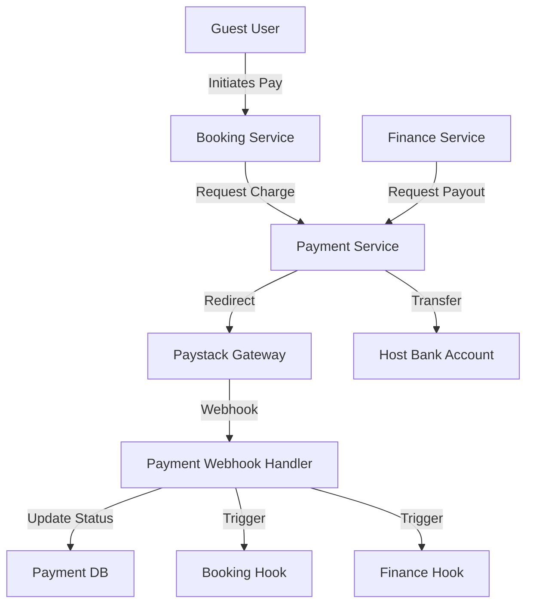

# Hauslet Payment System - Complete Guide

## Table of Contents

1. [Overview](#overview)
2. [Architecture](#architecture)
3. [Payment Lifecycle](#payment-lifecycle)
4. [Settlement vs. Payouts](#settlement-vs-payouts)
5. [Refund Management](#refund-management)
6. [Security & Compliance](#security--compliance)
7. [Paystack Integration](#paystack-integration)
8. [GraphQL API Reference](#graphql-api-reference)

---

## Overview

The **Hauslet Payment Module** is the financial backbone of the platform, responsible for securely processing guest payments, managing refunds, and disbursing payouts to hosts. It is designed to be **provider-agnostic** in architecture, though currently implemented with **Paystack** for the Nigerian market.

### Key Capabilities

*   **Secure Checkout**: PCI-compliant payment processing via redirect or saved cards.
*   **Escrow-like Holding**: Funds are verified and tracked before being released to hosts.
*   **Split Payments**: Capable of handling platform fees vs. host payouts (conceptually).
*   **Bank Verification**: Real-time validation of host bank account details.
*   **Ledger Integration**: Feeds transaction data to the Finance module for settlement.

---

## Architecture

The module sits between the **Booking Service** (upstream consumer) and the **Finance/Ledger Service** (downstream recorder).



---

## Payment Lifecycle

### State Machine

Payments flow through a strict state machine to ensure financial integrity.

| State | Description | Transition Trigger |
| :--- | :--- | :--- |
| **Pending** | Payment initiated, awaiting user action | User clicks "Pay" |
| **Succeeded** | Funds successfully captured | Webhook: `charge.success` |
| **Failed** | Transaction declined or error | Webhook: `charge.failed` |
| **Refunded** | Full amount returned to payer | Admin/System action |
| **Partially Refunded** | Part of the amount returned | Admin/System action |

### Flow Diagram

```
[Start] 
   │
   ▼
[Pending] ───(User Pays)───▶ [Succeeded] ───(Cancel)───▶ [Refunded]
   │                             │
   └───(Error)───▶ [Failed] ─────┘
                       │
                       ▼
                  [Retry Payment]
```

---

## Settlement vs. Payouts

It is crucial to distinguish between **Settlement** (Internal) and **Payouts** (External).

### 1. Settlement (Finance Module)
*   **What**: The logical allocation of funds within the Hauslet system.
*   **When**: Immediately upon Booking Cancellation (for retained funds) or Booking Completion (for host earnings).
*   **Action**: Updates the **Ledger** (e.g., Credit Host Wallet ₦150k, Credit Platform Revenue ₦20k).
*   **Module**: `Finance`.

### 2. Payouts (Payment Module)
*   **What**: The actual movement of money from Hauslet's bank account to the Host's bank account.
*   **When**: 48 hours after checkout (typically).
*   **Action**: Triggers a bank transfer via Paystack.
*   **Module**: `Payment`.

> **Key Takeaway**: The **Payment Module** handles the "Physical" movement of money (Incoiming from Guest, Outgoing to Host). The **Finance Module** handles the "Logical" ownership of that money while it sits in the system.

---

## Refund Management

The module supports sophisticated refund scenarios driven by the **Booking Module's** cancellation policies.

### Types of Refunds
1.  **Full Refund**: Reverses the entire transaction. The platform absorbs processing fees (if configured).
2.  **Partial Refund**: Returns a specific amount (e.g., 50% cancellation policy).
    *   *Note*: Partial refunds are theoretically supported by the system architecture, but provider support depends on the gateway (Paystack allows partial refunds).

### Refund Flow
When `BookingService` determines a refund is needed (e.g., Guest cancels):
1.  **Calculate**: Booking Service calculates `refundAmount` (via Pricing).
2.  **Request**: Calls `PaymentService.RefundPayment(paymentID, amount)`.
3.  **Execute**: Payment Service calls Paystack API.
4.  **Record**: 
    *   Updates Payment status to `Refunded` or `PartiallyRefunded`.
    *   Logs transaction type `refund` in the ledger.

---

## Security & Compliance

### PCI-DSS Compliance
*   **No Card Data Storage**: We never store raw credit card numbers (PAN) or CVC codes.
*   **Tokenization**: We store only `authorization_code` (from Paystack) to allow for "One-Click" future payments.
*   **Masking**: Only the last 4 digits and card brand (e.g., "Visa ending in 4242") are stored for display.

### Fraud Prevention
*   **Verification**: All payouts require `VerifyBankAccount` call which checks the account name against the provided name.
*   **Idempotency**: Webhooks are guarded against replay attacks using reference checks.

---

## Paystack Integration

### Webhooks
We listen to the `api/webhooks/paystack` endpoint.

**Crucial Events**:
*   `charge.success`: The only source of truth for a successful payment. We do *not* rely on the frontend redirect.
*   `transfer.success`: Confirms a payout reached the host.
*   `transfer.failed`: Alerts us to reverse a payout ledger entry.

### Metadata
Every transaction sent to Paystack includes metadata to trace it back:
```json
{
  "booking_id": "uuid-of-booking",
  "actor_id": "uuid-of-user",
  "environment": "production"
}
```

---

## GraphQL API Reference

### Key Mutations

#### `createPayment`
Initialize a payment session.
```graphql
mutation {
  createPayment(input: {
    amount: 5000000 # ₦50,000.00 (in minor units)
    currency: NGN
    payerEmail: "guest@example.com"
    bookingId: "booking-uuid"
  }) {
    authorizationUrl # Redirect user here
    reference        # Track this payment
  }
}
```

#### `savePaymentMethod`
Save a card for future use (after a successful first payment).
```graphql
mutation {
  savePaymentMethod(input: {
    authorizationCode: "AUTH_w12345" 
    last4Digits: "4242"
    brand: "visa"
  }) {
    id
  }
}
```

#### `processPayout` (Admin/System)
Trigger funds transfer to a host.
```graphql
mutation {
  processPayout(input: {
    amount: 4500000
    payoutDetailId: "bank-account-uuid"
    description: "Payout for Booking #123"
  }) {
    status # pending/success
  }
}
```
